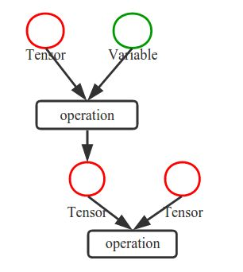

# TensorFlow入门


## TensorFlow的安装

linux系统下安装cpu版tensorflow较为简单，可以参考网页：https://blog.csdn.net/nxcxl88/article/details/52704877?locationNum=13。gpu版安装较为复杂


## 基本概念

张量(Tensor)：张量是tensorflow中基本的数据结构，可以简单理解为数组

计算图(Graph)：tensorflow中的模型通过计算图的方式定义，每一个计算都是计算图中的节点，节点之间的边描述了计算之间的依赖关系



会话(Session)：计算图仅仅定义了模型，并不能执行计算。执行计算需要通过会话来进行

```python
import tensorflow as tf

x = tf.constant([[1.0, 2.0]]) #常数张量
w = tf.constant([[3.0], [4.0]])

y = tf.matmul(x, W) #计算图节点

with tf.Session() as sess: #创建会话
	print (sess.run(y)) #运行计算
```


### 变量

变量是一类特殊的张量，其值可以通过反向传播训练

```python
w = tf.Variable(tf.random_normal([2,3], stddev=2, mean=0))
```

tf.truncated_normal(): 去掉过大偏离点(标准差)的正态分布

tf.random_uniform(): 平均分布

tf.zeros/tf.ones: 全零/一数组，tf.zeros([3,2], int32)

tf.fill: tf.fill([3,2], 6) 用常数6填充3*2的数组

tf.constant: tf.constant([3,2,1]) 直接给值


### 前向传播

```python
x = tf.placeholder(tf.float32, shape=(None,2))
#占位符，None对应训练样本个数，设为None方便处理不同数据集
W1 = tf.Variable(tf.random_normal([2,3]), stddev=1)
W2 = tf.Variable(tf.random_normal([3,1]), stddev=1)

a = tf.matmul(X, W1)
y = tf.matmul(a, W2)

with tf.Session() as sess:
	init_op = tf.global_variables_initializer()
	sess.run(init_op) #初始化所有变量	
	sess.run(y, feed_dict={x: [[...]]}) #输入数据
```


### 反向传播

```python
import tensorflow as tf

batch_size = 8

x = tf.placeholder(tf.float32, shape=(None, 2)) #训练集数据
y_ = tf.placeholder(tf.float32, shape=(None, 1)) #labels

W1 = tf.Variable(random_normal(...), std=1)
W2 = tf.Variable(random_normal(...), std=1)

a = tf.matmul(...)
y = tf.matmul(...)

loss = tf.reduce_mean(tf.square(y-y_)) #均方误差作为损失函数
train_step = tf.train.GradientDescentOptimizer(0.001).minimize(loss) #梯度下降
#train_step = tf.train.MomentumOptimizer(0.001, 0.9).minimizer(loss) #动量法
#train_step = tf.train.AdamOptimizer(0.001).minimize(loss) #Adam法

with tf.Session() as sess:
	init_op = tf.global_variables_initializer()
	sess.run(init_op)
	
	steps = 3000
	for i in range(steps):
		start = (i*batch_size) % 32
		#抽取batch_size组数据。当i等于4，start回复到0。这意味着每4步遍历一次数据集
		end = start + batch_size
		sess.run(train_step, feed_dict={x: X[start:end], y_: Y[start:end]}) #输入数据，进行训练
		print (sess.run(loss, feed_dict=...))
```


## 神经网络优化

### 损失函数

常用激活函数：tf.nn.relu(), tf.nn.sigmoid(), tf.nn.tanh()

交叉熵损失函数

```python
ce=-tf.reduce_mean(y_ * tf.log(tf.clip_by_value(y, 1.e-12, 1.0)))
#tf.clip_by_value: 限制数值范围
```

交叉熵刻画的是两个分布的差异程度

softmax

“软化”最大值

tf.nn.sparse_sofmax_cross_entropy_with_logits(): 结合了softmax的交叉熵函数

```python
ce = tf.reduce_mean(tf.nn.sparse_sofmax_cross_entropy_with_logits(logits=y, labels=tf.argmax(y_, 1)))
#tf.argmax(): 返回最大值所在下标。常用于将向量转换成数字
```


### 学习率

指数衰减学习率

```python
global_step = tf.Variable(0, trainable=False) 
#运行几轮batch_size的计数器，初值为0，不可训练
learning_rate = tf.train.exponential_decay(
learning_rate_base, #初始学习率
global_step,
learning_rate_step, #训练多少轮batch_size后更新一次学习率。一般设为总样本数/batch_size
learning_rate_decay, #学习率衰减率
staircase=True) #阶梯形衰减
```


### 滑动平均

滑动平均记录了每个参数一段时间内过往值的平均，增加了模型的泛化性

针对所有参数：w和b

shadow = decay * shadow + (1-decay) * value (decay越大，更新越慢)

shadow初值=value初值

decay=min{moving_average_decay, (1+轮数)/(10+轮数)} (一开始很小，后面维持在mad)

```python
ema = tf.train.ExponentialMovingAverage(
moving_average_decay, global_step)
ema_op = ema.apply([tf.trainable_variables]) #应用到所有可训练变量
with tf.control_dependecies([train_step, ema_op]):
	train_op = tf.no_op(name='train') #将更新训练参数和更新滑动平均值合为一个步骤
```


### 正则化

正则化的目的是缓解过拟合，通过引入模型复杂度抑制噪声。通常仅对W使用，不对b使用

loss=loss(y,y_)+Regularizer*loss(w)

```python
loss(w)=tf.contrib.layers.l1_regularizer()
#L1正则化，对w所有元素绝对值求和
loss(w)=tf.contrib.layers.l2_regularizer()
#L2正则化，对w所有元素平方的绝对值求和
tf.add_to_collection('losses', tf.contrib.layers.l2_regularizer)(w)
#另一种更常用的方法：把loss加入losses集合
loss = cem + tf.add_n(tf.get_collection('losses'))
#从集合中取出正则化项
```


### 命名空间

```python
with tf.variable_scope('layer1'):
	W=tf.get_variable("weight", [...], initializer=...)
    #等价于tf.Variable()
```


### 模块化的神经网络

```python
def forward(x, regularizer):
    '''前向传播'''
	w = tf.get_weight(...)
	b = tf.get_bias(...)
	y = tf.nn.relu(tf.matmul(x, w)+b)
	return y

def get_weight(shape, regularizer):
    '''获取权重'''
	w = tf.Variable(...)
	tf.add_to_collection('losses', tf.contrib.layers.l2_regularizer(regularizer)(w))
	return w

def get_bias(shape):
    '''获取偏置'''
	b = tf.Variable(...)
	return b
	
def backward():
    '''反向传播'''
	x = tf.placeholder(...)
	y_ = tf.placeholder(...)
	y = forward.forward(x, regularizer)
    
	global_step = tf.Variable(0, trainable=False)
    #定义损失函数
	ce = tf.nn.sparse_softmax_cross_entropy_with_logits(logits=y,labels=tf.argmax(y_, 1))
	loss = ce + tf.add_n(tf.get_collection('losses'))
	
    #定义指数衰减学习率
	learning_rate = tf.train.exponential_decay(
		learning_rate_base,
		global_step,
		learning_rate_step,
		staircase=True)
	
    #定义优化器和滑动平均变量
	train_step = tf.train.GradientDescentOptimizer(learning_rate).minimize(loss, global_step=global_step)
	ema = tf.train.ExponentialMovingAverage(moving_average_decay, global_step)
	ema_op = ema.apply(tf.trainable_variables())
    
	with tf.control_dependencies([train_step, ema_op]):
		train_op = tf.no_op(name='train')
	
    #创建会话并开始训练
	with tf.Session() as sess:
		init_op = tf.global_variables_initializer()
		sess.run(init_op)
		
		for i in range(steps):
			sess.run(train_step, feed_dict={x:... , y_:... })
			if ...:
				print ...
```


## 全连接神经网络

tf.get_collection("")：从集合中取出全部变量，生成一个列表

tf.add_n([])：把列表内对应元素相加

tf.cast(x, dtype)：转换类型

tf.argmax(x, axis)：返回最大值所在索引

with tf.Graph().as_default() as g: 将其内定义的节点放在计算图g中

保存模型：

```python
saver = tf.train.Saver()
saver.save(sess, path, global_step=global_step)
```

加载模型：

```python
ckpt=tf.train.get_checkpoint_state(path)
if ckpt and ckpt.model_checkpoint_path:
	saver.restore(sess, ckpt.model_chekpoint_path)
```

还原滑动平均值

```python
ema = tf.train.ExponentialMovingAverage(0.99)
ema_restore = ema.variables_to_restore()
saver = tf.train.Saver(ema_restore)
```

计算准确率

```python
correct_prediction = tf.equal(tf.argmax(y, 1), tf.argmax(y_, 1))
#tf.argmax: 返回最大数值所在下标。axis即最大值操作在这个维度进行
accuracy = tf.reduce_mean(tf.cast(correct_prediction, tf.float32))
```


### 示例：用全连接神经网络识别mnist图像

前向传播 mnist_forward.py

反向传播 mnist_backward.py

测试 mnist_test.py


forward

```python
import tensorflow as tf

Input_Node = 784 #输入维度
Output_Node =10 #输出维度
Layer1_Node = 500 #隐藏层

def get_weight(shape, regularizer_rate):
    '''获取权重'''
    w = tf.get_variable('weights', shape, initializer=tf.truncated_normal_initializer(stddev=0.1))
    if regularizer_rate != None:
        tf.add_to_collection('losses', tf.contrib.layers.l2_regularizer(regularizer_rate)(w))
    return w
    
def get_bias(shape):
    '''获取偏置'''
    b = tf.get_variable('biases', shape, initializer=tf.constant_initializer(0.0))
    #等价于b = tf.Variable(tf.zeros(shape))
    return b

def forward(x, regularizer_rate):
    '''前向传播'''
    with tf.variable_scope('layer1'):
        w = get_weight([Input_Node, Layer1_Node], regularizer_rate)
        b = get_bias([Layer1_Node])
        y1 = tf.nn.relu(tf.matmul(x, w) + b)
    
    with tf.variable_scope('layer2'):
        w = get_weight([Layer1_Node, Output_Node], regularizer_rate)
        b = get_bias([Output_Node])
        y2 = tf.matmul(y1, w) + b

    return y2
```


backward

```python
import tensorflow as tf
from tensorflow.examples.tutorials.mnist import input_data
import mnist_forward
import os

Batch_Size = 100 #一个batch中的样本个数
Learning_Rate_Base = 0.8 #初始学习率
Learning_Rate_Decay =0.99 #学习率衰减率
Regularizer_Rate = 0.0001 #正则化系数
Steps = 30000 #训练步数
Moving_Average_Decay = 0.99 #滑动平均衰减率
Model_Save_Path = './model/FC/' #模型存储地址
Model_Name = 'mnist_model.ckpt' #模型名称

def backward(mnist):
    '''反向传播'''
    x = tf.placeholder(tf.float32, [None, mnist_forward.Input_Node], name='x_input')
    y_ = tf.placeholder(tf.float32, [None, mnist_forward.Output_Node], name='y_input')
    y = mnist_forward.forward(x, Regularizer_Rate)
    global_step = tf.Variable(0, trainable=False)

    #滑动平均变量
    ema = tf.train.ExponentialMovingAverage(Moving_Average_Decay, global_step)
    ema_op = ema.apply(tf.trainable_variables()) 

    #损失函数
    ce = tf.nn.sparse_softmax_cross_entropy_with_logits(logits=y, labels=tf.argmax(y_, axis=1))
    cem = tf.reduce_mean(ce)
    loss = cem + tf.add_n(tf.get_collection('losses'))
    
    #学习率
    learning_rate = tf.train.exponential_decay(
        Learning_Rate_Base,
        global_step,
        mnist.train.num_examples / Batch_Size,
        Learning_Rate_Decay,
        staircase=True)
        
    #优化器    
    train_step = tf.train.GradientDescentOptimizer(learning_rate).minimize(loss, global_step=global_step)

    with tf.control_dependencies([train_step, ema_op]):
        train_op = tf.no_op(name='train')
        
    #创建会话并开始训练    
    saver = tf.train.Saver()
    with tf.Session() as sess:
        init_op = tf.global_variables_initializer()
        sess.run(init_op) 
        for i in range(Steps):
            xs, ys = mnist.train.next_batch(Batch_Size)
            _, loss_value, step = sess.run([train_op, loss, global_step], feed_dict={x: xs, y_: ys})
            if i % 1000 == 0: #每1000步打印一次损失函数值
                print('After %d step(s), loss is %g.' %(step, loss_value))
                saver.save(sess, os.path.join(Model_Save_Path, Model_Name), global_step=global_step)
                    
def main(argv=None):
    mnist = input_data.read_data_sets('./data/mnist_data', one_hot=True)
    backward(mnist)
    
if __name__ == '__main__':
    tf.app.run() #主程序入口
```


test

```python
import time
import tensorflow as tf
from tensorflow.examples.tutorials.mnist import input_data
import mnist_forward
import mnist_backward

Test_Interval_Secs = 10 #测试时间间隔为10秒

def test(mnist):
    '''测试函数'''
    with tf.Graph().as_default() as g:
        x = tf.placeholder(tf.float32, [None, mnist_forward.Input_Node])
        y_ = tf.placeholder(tf.float32, [None, mnist_forward.Output_Node])
        y = mnist_forward.forward(x, None)

        #滑动平均变量
        ema = tf.train.ExponentialMovingAverage(mnist_backward.Moving_Average_Decay)
        ema_restore = ema.variables_to_restore()
        saver = tf.train.Saver(ema_restore)
        
        #计算正确率
        correct_prediction = tf.equal(tf.argmax(y, 1), tf.argmax(y_, 1))
        accuracy = tf.reduce_mean(tf.cast(correct_prediction, tf.float32))
        
        gpu_options = tf.GPUOptions(per_process_gpu_memory_fraction=0.3) #分配显存
        sess = tf.Session(config=tf.ConfigProto(gpu_options=gpu_options))  
        while True:   
            ckpt = tf.train.get_checkpoint_state(mnist_backward.Model_Save_Path)
            if ckpt and ckpt.model_checkpoint_path:
                #从模型中恢复滑动平均变量
                saver.restore(sess, ckpt.model_checkpoint_path)
                global_step = ckpt.model_checkpoint_path.split('/')[-1].split('-')[-1]
                accuracy_score = sess.run(accuracy, feed_dict={x: mnist.test.images, y_: mnist.test.labels})
                print('After %s training step(s), test accuracy = %g' %(global_step, accuracy_score))
            else:
                print('No checkpoint file found')
                return
            time.sleep(Test_Interval_Secs)
        sess.close()
            
def main():
    mnist = input_data.read_data_sets('./data/mnist_data', one_hot=True)
    test(mnist)
    
if __name__ == '__main__':
    main()
```


## 卷积神经网络

卷积层

```python
tf.nn.conv2d(input, filter, strides, padding)
```

input: 输入tensor，shape为[batch, height, witdth, channels]

filter: 卷积核尺寸，[f_height, f_width, in_channels, out_channels]

strides: 移动步长，[1, s_h, s_w, 1]

padding: 'VALID'/'SAME'


池化层

```python
tf.nn.max_pool(value, ksize, strides, padding, name=None)
tf.nn.avg_pool
```

value: 输入数据，shape同卷积层

ksize: 窗口大小，[1, height, width, 1]

strides: 同卷积

padding: 同卷积


dropout

```python
tf.nn.dropout(x, keep_prob) 
```

x: 输出tensor

keep_prob: 保留比例

仅在训练时dropout。一般用于全连接网络


### 卷积网络示例：LeNet-5

forward

```python
import tensorflow as tf

Image_Size = 28 #图片尺寸为28x28
Num_Channels = 1 #灰度图像
Conv1_Size = 5 #第一个卷积层kernel尺寸
Conv1_Kernel_Num = 32 #第一个卷积层kernel数量
Conv2_Size = 5 #第二个卷积层kernel尺寸
Conv2_Kernel_Num = 64 #第二个卷积层kernel数量
FC_Size = 512 #全连接层维度
Output_Node = 10 #输出维度

def get_weight(shape, regularizer_rate):
    '''获取权重'''
    w = tf.Variable(tf.truncated_normal(shape, stddev=0.1))
    if regularizer_rate != None: 
        tf.add_to_collection('losses', tf.contrib.layers.l2_regularizer(regularizer_rate)(w))
    return w

def get_bias(shape):
    '''获取偏置'''
    b = tf.Variable(tf.zeros(shape))
    return b

def conv2d(x, w):
    '''卷积层'''
    return tf.nn.conv2d(x, w, strides=[1, 1, 1, 1], padding='SAME')

def max_pool(x):
    '''池化层'''
    return tf.nn.max_pool(x, ksize=[1, 2, 2, 1], strides=[1, 2, 2, 1], padding='SAME')

def forward(x, train, regularizer_rate):
    '''前向传播'''
    #第一个卷积层
    conv1_w = get_weight([Conv1_Size, Conv1_Size, Num_Channels, Conv1_Kernel_Num], regularizer_rate)
    conv1_b = get_bias([Conv1_Kernel_Num])
    conv1 = conv2d(x, conv1_w)
    relu1 = tf.nn.relu(tf.nn.bias_add(conv1, conv1_b))
    pool1 = max_pool(relu1)

    #第二个卷积层
    conv2_w = get_weight([Conv2_Size, Conv2_Size, Conv1_Kernel_Num, Conv2_Kernel_Num], regularizer_rate)
    conv2_b = get_bias([Conv2_Kernel_Num])
    conv2 = conv2d(pool1, conv2_w)
    relu2 = tf.nn.relu(tf.nn.bias_add(conv2, conv2_b))
    pool2 = max_pool(relu2)

    #改变形状以便传入全连接层
    pool_shape = pool2.get_shape().as_list()
    nodes = pool_shape[1] * pool_shape[2] * pool_shape[3]
    reshaped = tf.reshape(pool2, [-1, nodes])

    #第一个全连接层，也可以用tf.nn.dense()实现
    fc1_w = get_weight([nodes, FC_Size], regularizer_rate)
    fc1_b = get_bias([FC_Size])
    fc1 = tf.nn.relu(tf.matmul(reshaped, fc1_w) + fc1_b)
    if train:
        fc1 = tf.nn.dropout(fc1, 0.5) #在训练过程使用dropout

    #第二个全连接层
    fc2_w = get_weight([FC_Size, Output_Node], regularizer_rate)
    fc2_b = get_bias([Output_Node])
    y = tf.matmul(fc1, fc2_w) + fc2_b
    
    return y
```


backward

```python
import tensorflow as tf
from tensorflow.examples.tutorials.mnist import input_data
import LeNet_5
import os
import numpy as np

Batch_Size = 100 #一个batch的样本数量
Learning_Rate_Base = 0.01 #初始学习率
Learning_Rate_Decay =0.99 #学习率衰减率
Regularizer_Rate = 0.0001 #正则化系数
Steps = 30000 #训练步数
Moving_Average_Decay = 0.99 #滑动平均衰减率
Model_Save_Path = './model/LeNet_5/' #模型保存地址
Model_Name = 'mnist_model.ckpt' #模型名称

def backward(mnist):
    '''反向传播'''
    x = tf.placeholder(tf.float32, [None, LeNet_5.Image_Size, LeNet_5.Image_Size, LeNet_5.Num_Channels], name='x_input')
    y_ = tf.placeholder(tf.float32, [None, LeNet_5.Output_Node], name='y_input')
    y = LeNet_5.forward(x, True, Regularizer_Rate)
    global_step = tf.Variable(0, trainable=False)

    #损失函数
    ce = tf.nn.sparse_softmax_cross_entropy_with_logits(logits=y, labels=tf.argmax(y_, axis=1))
    cem = tf.reduce_mean(ce)
    loss = cem + tf.add_n(tf.get_collection('losses'))
    
    #学习率
    learning_rate = tf.train.exponential_decay(
        Learning_Rate_Base,
        global_step,
        mnist.train.num_examples / Batch_Size,
        Learning_Rate_Decay,
        staircase=True)
        
    #优化器
    train_step = tf.train.GradientDescentOptimizer(learning_rate).minimize(loss, global_step=global_step)

    #滑动平均变量
    ema = tf.train.ExponentialMovingAverage(Moving_Average_Decay, global_step)
    ema_op = ema.apply(tf.trainable_variables()) 
   
    with tf.control_dependencies([train_step, ema_op]):
        train_op = tf.no_op(name='train')
        
    #创建会话并开始训练
    saver = tf.train.Saver() 
    with tf.Session() as sess:
        #如果存在模型文件则直接读取
        ckpt = tf.train.get_checkpoint_state(Model_Save_Path)
        if ckpt and ckpt.model_checkpoint_path:
            saver.restore(sess, ckpt.model_checkpoint_path)
        else:
            init_op = tf.global_variables_initializer()
            sess.run(init_op) 
            
        for i in range(Steps):
            xs, ys = mnist.train.next_batch(Batch_Size)
            #xs是一维数据，需要reshape成二维以便卷积层处理
            reshaped_xs = np.reshape(xs, (Batch_Size, LeNet_5.Image_Size, LeNet_5.Image_Size, LeNet_5.Num_Channels))
            _, loss_value, step = sess.run([train_op, loss, global_step], feed_dict={x: reshaped_xs, y_: ys})
            
            if i % 1000 == 0:
                print('After %d step(s), loss is %g.' %(step, loss_value))
                saver.save(sess, os.path.join(Model_Save_Path, Model_Name), global_step=global_step)
        
def test(mnist):
    '''测试函数'''
    with tf.Graph().as_default() as g:
        x = tf.placeholder(tf.float32, [None, LeNet_5.Image_Size, LeNet_5.Image_Size, LeNet_5.Num_Channels])
        y_ = tf.placeholder(tf.float32, [None, LeNet_5.Output_Node])
        y = LeNet_5.forward(x, False, 0.0)

        #滑动平均变量
        ema = tf.train.ExponentialMovingAverage(Moving_Average_Decay)
        ema_restore = ema.variables_to_restore()
        saver = tf.train.Saver(ema_restore)
        
        #计算正确率
        correct_prediction = tf.equal(tf.argmax(y, 1), tf.argmax(y_, 1))
        accuracy = tf.reduce_mean(tf.cast(correct_prediction, tf.float32))
        
        test_feed = {x: mnist.test.images.reshape(-1, LeNet_5.Image_Size, LeNet_5.Image_Size, LeNet_5.Num_Channels),\
                            y_: mnist.test.labels}
        
        with tf.Session() as sess:
            ckpt = tf.train.get_checkpoint_state(Model_Save_Path)
            if ckpt and ckpt.model_checkpoint_path:
                #从模型中恢复滑动平均变量
                saver.restore(sess, ckpt.model_checkpoint_path)
                global_step = ckpt.model_checkpoint_path.split('/')[-1].split('-')[-1]
                accuracy_score = sess.run(accuracy, feed_dict=test_feed)
                print('test accuracy = %g' %(accuracy_score))
            else:
                print('No checkpoint file found')
                return          
        
def main(argv=None):
    mnist = input_data.read_data_sets('./data/mnist_data', one_hot=True)
    backward(mnist)
    test(mnist)
    
if __name__ == '__main__':
    tf.app.run()
```


## 循环神经网络

```python
#LSTM example
lstm = tf.nn.rnn_cell.BasicLSTMCell(lstm_hidden_size)
state = lstm.zeros_state(batch_size, tf.float32)

loss = 0.0
for i in range(num_steps):
	if i>0:
		tf.get_variable_scope().reuse_variables()
    	#变量共享，因为rnn不同时间使用同一组变量
	lstm_output, state = lstm(current_input, state)
	final_output = fully_connected(lstm_output)
	loss += calc_loss(final_output, expected_output)
```

tf.nn.rnn_cell.BasicLSTMCell(n_hidden, forget_bias=1.0)

BasicLSTMCell代表一个lstm单元（即每个时刻的处理单元）

​	n_hidden: 隐藏层大小

​	forget_bias: 遗忘门偏置项

zero_state(batch_size, dtype)

​	返回全零状态张量

\__call__(inputs, state)

​	输入：

​	inputs: 输入张量，[batch_size, input_size]

​	state: 状态张量或张量元组

​	返回：

​	Output: 输出张量，[batch_size, self.output_size]

​	New state: 状态张量或张量元组

注意：与GRU不同，LSTM有两个state


### 示例：用双向LSTM识别mnist图片

```python
import tensorflow as tf
from tensorflow.contrib import rnn
import numpy as np

from tensorflow.examples.tutorials.mnist import input_data
mnist = input_data.read_data_sets("./data/mnist_data", one_hot=True)

learning_rate = 0.01 #学习率
training_steps = 10000 #训练步数
batch_size = 128 #每个batch里样本数
display_step = 10 #显示屏幕信息步数间隔

n_input = 28 # 每个时间步输入数据的维度
time_steps = 28 # 时间步数。与n_input共同组成一张图像的维度
n_hidden = 256 # 隐藏层维度
n_classes = 10 # 分类数0~9

x = tf.placeholder("float", [None, time_steps, n_input])
y_ = tf.placeholder("float", [None, n_classes])

weights = tf.Variable(tf.random_normal([2*n_hidden, n_classes]))
biases = tf.Variable(tf.random_normal([n_classes]))

def BiRNN(x, weights, biases):
    #将(batch_size, time_steps, num_input)的数据转换成形状为(batch_size, num_input), 长度为time_steps的列表
    x = tf.unstack(x, time_steps, 1)

    # 向右传播的lstm
    lstm_fw_cell = rnn.BasicLSTMCell(n_hidden, forget_bias=1.0)
    # 向左传播的lstm
    lstm_bw_cell = rnn.BasicLSTMCell(n_hidden, forget_bias=1.0)

    try:
        outputs, _, _ = rnn.static_bidirectional_rnn(lstm_fw_cell, lstm_bw_cell, x, dtype=tf.float32)
    except Exception: # Old TensorFlow version only returns outputs not states
        outputs = rnn.static_bidirectional_rnn(lstm_fw_cell, lstm_bw_cell, x, dtype=tf.float32)

    # 此处不使用激活函数，会在交叉熵部分使用softmax
    return tf.matmul(outputs[-1], weights) + biases

#计算预测值
pred = BiRNN(x, weights, biases)

#损失函数和优化器
loss_op = tf.reduce_mean(tf.nn.softmax_cross_entropy_with_logits(logits=pred, labels=y_))
optimizer = tf.train.AdamOptimizer(learning_rate=learning_rate)
train_op = optimizer.minimize(loss_op)

#计算准确率
correct_pred = tf.equal(tf.argmax(pred, 1), tf.argmax(y_, 1))
accuracy = tf.reduce_mean(tf.cast(correct_pred, tf.float32))

#创建会话并开始训练
init_op = tf.global_variables_initializer()
with tf.Session() as sess:
    sess.run(init_op)

    for step in range(training_steps):
        batch_x, batch_y = mnist.train.next_batch(batch_size)
        batch_x = batch_x.reshape((batch_size, time_steps, n_input))
        #将输入数据reshape成(batch_size, time_steps, n_input)形状
        sess.run(train_op, feed_dict={x: batch_x, y_: batch_y})
        if step % display_step == 0:
            loss, acc = sess.run([loss_op, accuracy], feed_dict={x: batch_x, y_: batch_y})
            print("Step " + str(step) + ", Minibatch Loss= " + "{:.4f}".format(loss) + ", Training Accuracy= " + "{:.3f}".format(acc))

    print("Optimization Finished!")

    test_len = 10000
    test_data = mnist.test.images[:test_len].reshape((-1, time_steps, n_input))
    test_label = mnist.test.labels[:test_len]
    print("Testing Accuracy:", sess.run(accuracy, feed_dict={x: test_data, y_: test_label}))
```


### 演示：TensorFlow playground

http://playground.tensorflow.org/

用auto encoder重构图像

用gan生成手写数字